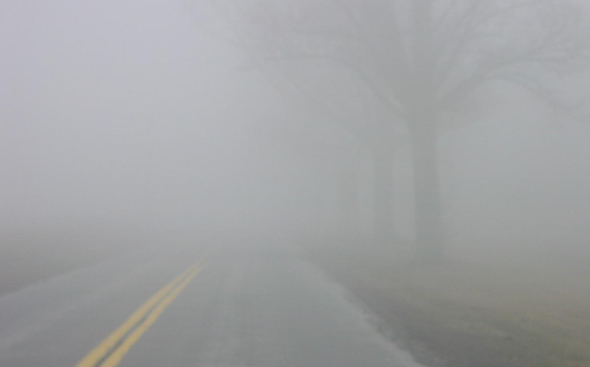
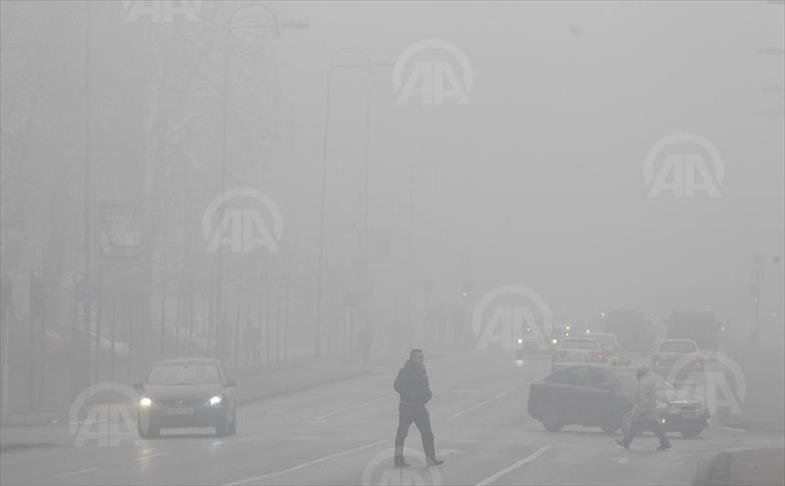
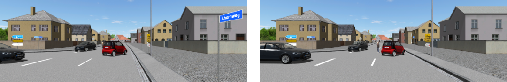

# README

### Research objectives

This research focuses on algorithms designed to compensate for the impact of environmental conditions on automotive sensor data. The primary objective is to enhance existing algorithms in order to increase the informational value of sensor outputs. A key challenge addressed in this thesis is the simulation of distorted sensor data under diverse environmental scenarios—including rain, snow, fog, lightning, solar reflections, and shading—since such data is difficult to obtain in real-world testing. While standard sensor data can be reliably acquired through test benches, replicating adverse conditions is more complex. To overcome this limitation, synthetic data is employed to generate varied environmental conditions, thereby enabling the development and improvement of robust algorithms.

Some of the problems that can be visualized are:

|                                     |                                                                              |
| ----------------------------------- | ---------------------------------------------------------------------------- |
|        |  |
|  |                                            |

Recreation of images in virtual world with in clear blue sky and simulated rain droplets

<figure><figcaption>
<strong>Clear blue sky . Left Side Frame 1 &#x26; Right Side Frame 2</strong>
</figcaption></figure>

<figure><figcaption>
<strong>Detection of moving points from one frame to another</strong>
</figcaption></figure>

<figure><figcaption>
<strong>Night time with rain . Left Side Frame 1 &#x26; Right Side Frame 2</strong>
</figcaption></figure>

<figure><figcaption>
<strong>Detection of cars as well as rain drops from one frame to another</strong>
</figcaption></figure>

As we see the rain droplets has created considerable noise, and therefore a challenge in reliably detecting the vehicle movements.

### Proposed Solution

<figure><figcaption>
<strong>Situational Awareness</strong>
</figcaption></figure>

By methods using situational awareness, the detection of relevant objects has considerably increased. By increasing priority to those elements in the sensor snapshot which are more meaninful to the situation, it is possible to compute better results.

### A virtual image with ground truth and object detection:

Image of cars shown from driver perspective along with detected objects in the virtual sensor snapshot

<figure><figcaption></figcaption></figure>

Development of sensor model to support the rapid development and testing of downstream ADAS algorithms. Synthetic scene generation is performed using Hexagon VTD, which triggers dynamic scenarios through OpenSceneGraph and XML‑based OpenDrive.

The objective is to improve ADAS algorithm performance when sensor data is degraded by environmental conditions such as rain, fog, reflections, and other distortions. Potential solution approaches include:

1. Enhancing situational awareness within the same sensor snapshot
2. Correlating and fusing data across multiple heterogeneous sensors
3. Incorporating sensor information from neighbouring entities, such as nearby vehicles and infrastructure
4.  Decoupling of sensors to algorithms. This means that controllers themselves do not know where data has arrived from. It could be from a data from within the car environment or also from a different car.

    \
     

<figure><figcaption></figcaption></figure>

Challenges : Distortion can also happen during sensor fusion.&#x20;

Output is a fitness landscape - A 3-D graph with inputs being environmental conditions and output health of ADAS functionality. Attributes being reliability of results.

#### **Repositories and Submodules** 

<table data-view="cards"><thead><tr><th></th><th data-type="content-ref"></th><th data-hidden data-card-cover data-type="image">Cover image</th></tr></thead><tbody><tr><td>Motion Flow Priority Graph Sensors</td><td><a href="https://www.github.com/parabola-x2/MotionFlowPriorityGraphSensors">https://www.github.com/parabola-x2/MotionFlowPriorityGraphSensors</a></td><td><a href="https://images.unsplash.com/photo-1605035015406-54c130d0bf89?crop=entropy&#x26;cs=srgb&#x26;fm=jpg&#x26;ixid=M3wxOTcwMjR8MHwxfHNlYXJjaHw3fHxyYWlueXxlbnwwfHx8fDE3NjUxMzkzNjd8MA&#x26;ixlib=rb-4.1.0&#x26;q=85">https://images.unsplash.com/photo-1605035015406-54c130d0bf89?crop=entropy&#x26;cs=srgb&#x26;fm=jpg&#x26;ixid=M3wxOTcwMjR8MHwxfHNlYXJjaHw3fHxyYWlueXxlbnwwfHx8fDE3NjUxMzkzNjd8MA&#x26;ixlib=rb-4.1.0&#x26;q=85</a></td></tr></tbody></table>

 

 
